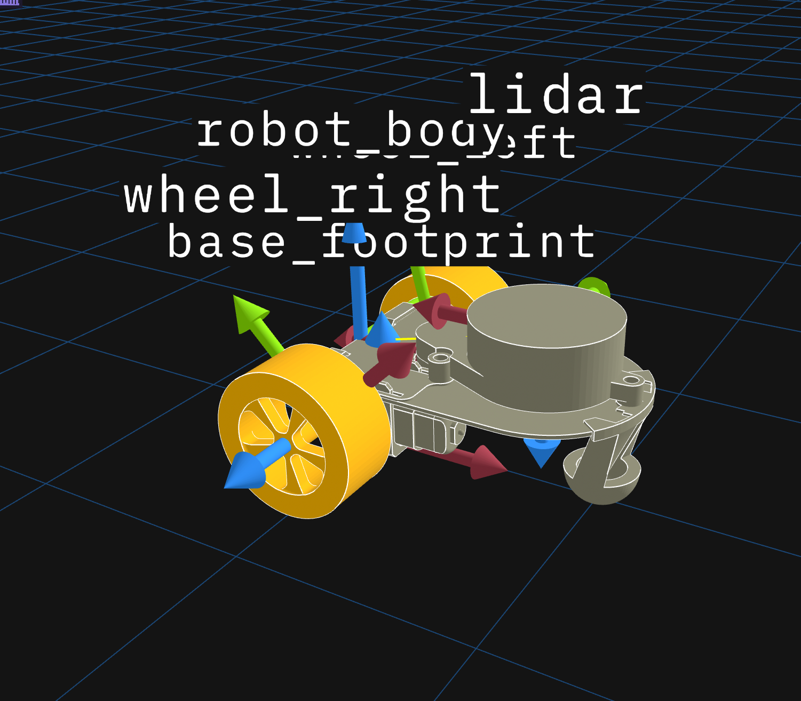
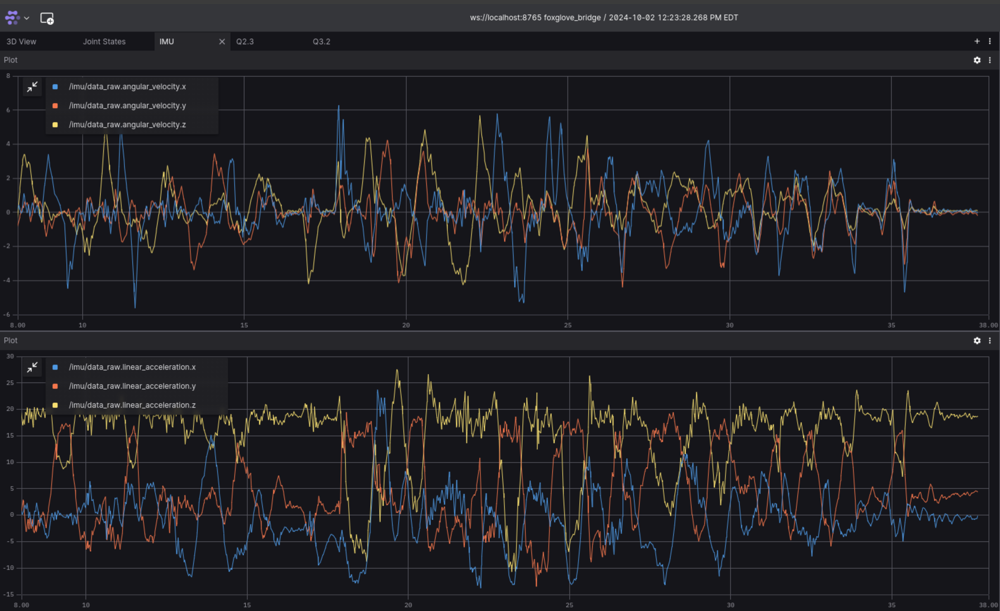

# HW 2: Kinematics and Odometry

In Foundations of Robotics you've been learning about kinematic models for wheeled robots. In this assignment, we're going to characterize a kinematic model for Little Red Rover, then apply it to compute a position estimate for the rover.

## Before you start
1. Software updates! **Read this carefully.**
   * Firmware:
       - Visit the [firmware tool](https://little-red-rover.com/#/firmware_tool). Follow the instructions on that page to connect your rover, then click "program".
   * ROS:
       - In a terminal outside of docker, open your lrr-fa24-beta folder. Run the following command:
       ```
       git pull && git submodule update
       ``` 
       - Within Docker, run
       ```
       lrr_build
       ```
    * If you're using Mac or Windows, [enable host networking in Docker Desktop](https://docs.docker.com/engine/network/drivers/host/#docker-desktop).
    * Reconnect your robot to wifi. See [connecting to campus wifi.](https://github.com/empriselab/lrr-fa24-beta/blob/noetic/guides/connecting_to_on_campus_wifi.md)
2. I've provided some Foxglove utilities in lrr-fa24-beta-hw2/foxglove.
    * Apply the layout `lrr_hw2_layout.json` in Foxglove in the same way you did in HW1.
    * Drag and drop the file `yulong.virtual-joystick-0.0.2.foxe` into the Foxglove window.
      - This is a Foxglove extension that allows us to control the rover using a joystick.
      - After this is done, the top right panel will show the joystick instead of saying "Unknown panel type". 

## Q0. Investigating Transforms in Foxglove (10 pts)

As you've covered in class, [TF](http://wiki.ros.org/tf) is a ROS package that we use to keep track of 3D coordinate frames.

Little Red Rover contains a number of such frames, and we can view them within Foxglove.
1. Click the gear in the top right of the 3D Panel, which will open it's settings in a panel on the left.
2. Drop down the "transforms" section, and make each transform visible (click the closed eye on each transform). It should look something like this:



**Q0.1:** In Foxglove, examine the rover and its transforms. The x axis for each frame is red, the y axis is green, and the z axis is blue.
* In Foxglove, find the frame `base_link`. Relative to this frame, along which axis does the rover move forward?
* Now, look at wheel frames (`wheel_left`, `wheel_right`).
Rotation follows the right hand rule.
What rotation direction (positive or negative) will each wheel rotate when the rover moves forward?
 
Put your answers in writeup.md.
  
## Q1. Identifying a Kinematic Model (20 pts)
Refer to the course notes on mobile robot kinematics, specifically differential drive steering.

**Q1.1:** Given a target linear velocity $\upsilon$ and angular velocity $\omega$ for a differential drive robot with wheel separation $b$ (m), write an equation for the rover's wheel velocities $\upsilon_{l}$, $\upsilon_{r}$ (in m/s).
You may do this either by embedding Latex or taking a picture of your handwritten work (any illegible work will not be graded).

**Q1.2:** Given wheel velocities $\upsilon_{l}$, $\upsilon_{r}$ (m/s), write an equation for the resulting linear velocity $\upsilon$ (m/s) and angular velocity $\omega$ (rad/s) for a differential drive robot with wheel separation $b$ (m).

Put your answers in writeup.md.

## Q2. Inverse Kinematics (20 pts)

As part of its control loop, the rover uses inverse kinematics to calculate its wheel speeds. You'll compute your own IK solution and compare it to what the rover outputs.

**Q2.1:** Follow the instructions in `hw2_pkg/hw2_pkg/inverse_kinematics.py` to implement the equations you identified in Q1.1, then publish joint state messages with the contents.

Be careful with your signs! Think about your answer to Q0.1

To test your node, run:

```
rostest hw2_pkg ik_tests.test
```

**Q2.2:** Run teleop using:
```
roslaunch little_red_rover teleop.launch
```
(this is equivalent to running `lrr_run`)

In a separate terminal, run
```
rosrun hw2_pkg inverse_kinematics.py
```
to execute your node.

The provided Foxglove layout has a tab labeled Q2.3, setup with two plot panels. 

Using one plot panel for each wheel, plot:

* Your computed velocity on topic `/joint_states_predicted.velocity[0]` and `/joint_states_predicted.velocity[1]` (left and right respectively) vs 
* The ground truth velocity calculated by the wheel encoders on topic `/joint_states.velocity[0]` / `/joint_states.velocity[1]`.

Reference the other tabs "Joint States" and "IMU" for examples of how to plot in Foxglove.


> *IMU plot panel*

Drive the rover around to collect data. The predicted velocity and the actual velocity should follow the same trends.

Attach a screenshot of your plots zoomed in to show an interesting section.

**Q2.3:** Talk a little about what you see in the graph you generated. Are your computed value far off from the actual value? What could account for those differences?

Put your answers in writeup.md.

## Q3. Forward Kinematics (20 pts)

Now lets do forward kinematics.

**Q3.1:** Follow the instructions in `hw2_pkg/hw2_pkg/forward_kinematics.py` to implement the equations you identified in Q1.2, then publish a Twist message with the result. Compute the twist based on the actual wheel velocities as reported by the wheel encoders.

To test your node, run:
```
rostest hw2_pkg fk_tests.test
```

**Q3.2:**
If it's not already running, run teleop using:
```
roslaunch little_red_rover teleop.launch
```

In a separate terminal, run
```
rosrun hw2_pkg forward_kinematics.py
```

The provided Foxglove layout has a tab labeled Q3.2 with two plot panels provided. In one plot panel, plot the values:

* Linear velocity computed from actual wheel velocities (on topic `/twist_ground_truth.linear.x`) vs 
* Commanded linear velocity (on topic `/cmd_vel.linear.x`).

In a second, plot the values:

* Angular velocity computed from actual wheel velocities (on topic `/twist_ground_truth.angular.z`) vs 
* Commanded angular velocity (on topic `/cmd_vel.angular.z`).

Drive the rover around to collect data.
Attach a screenshot of your plots zoomed in to show an interesting section.

**Q3.3:** Talk a little about what you see in the graph.
* How do the commanded and actual velocities compare?
* What could account for those differences?

Put your answers in writeup.md.

## Q4. Calculating an Odometry Solution (30 pts)

Now that we've calculated the actual velocity of the rover, we'll integrate these velocities to estimate the robots trajectory.
To understand whats happening here, it may be useful to skim the ROS conventions for [Coordinate Frames for Mobile Platforms](https://www.ros.org/reps/rep-0105.html).

**Q4.1:** In `hw2_pkg/hw2_pkg/odometry.py` integrate the Twist messages and publish an Odometry message.

To test your node, run:
```
rostest hw2_pkg odom_tests.test
```
You should pass all tests that don't include "transform".

**Q4.2:** Also in `hw2_pkg/hw2_pkg/inverse_kinematics.py`, use the odometry information to publish a transform between `odom` (parent frame) and `base_footprint` (child frame).

To test your node, run:
```
rostest hw2_pkg odom_tests.test
```

**Q4.3:** 
If it's not already running, run teleop using:
```
roslaunch little_red_rover teleop.launch
```

In a separate terminal, run
```
rosrun hw2_pkg forward_kinematics.py
```

In a third terminal, run
```
rosrun hw2_pkg odometry.py
```

In Foxglove, open the 3D panel's settings. Expand the frame drop down, set the follow frame to `odom` and the follow mode to pose.
Drive the rover around and you should see it moving relative to the `odom` frame!

To qualitatively measure the performance of your odometry, lets run some experiments. In each of the following situations, teleoperate the rover and see how the odometry updates.
1. Hold the rover with its wheels in the air.
2. Stop one of the wheels with your hand.
3. Run the rover into a wall.

How does the odometry handle these contingencies? What other capabilities of the rover could we integrate to address these shortfalls?

Put your answers in writeup.md.

## Deliverables

1. Zip and submit lrr-fa24-beta-hw2 on Gradescope.
2. Fill out the [hw2 feedback form](https://forms.gle/fDiYX7ctMMFo2rXc8).

Good job! :)
