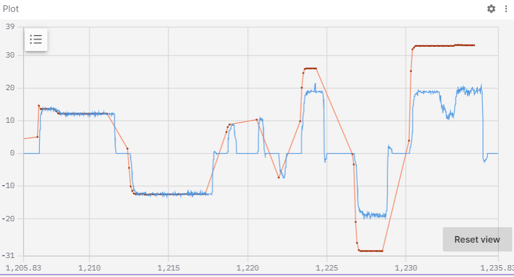
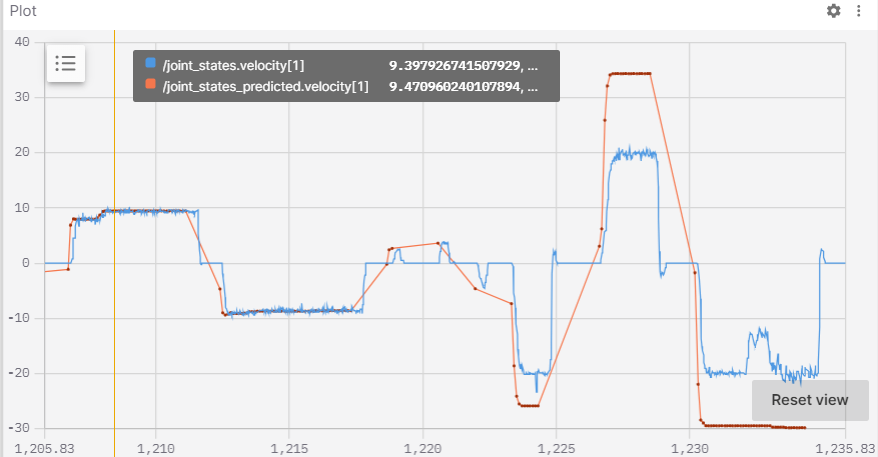
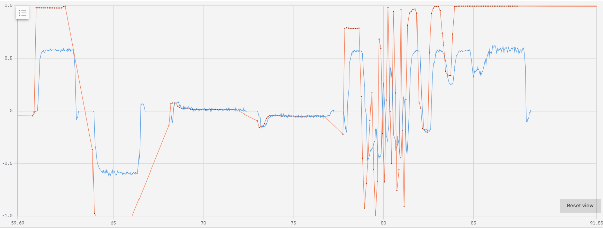
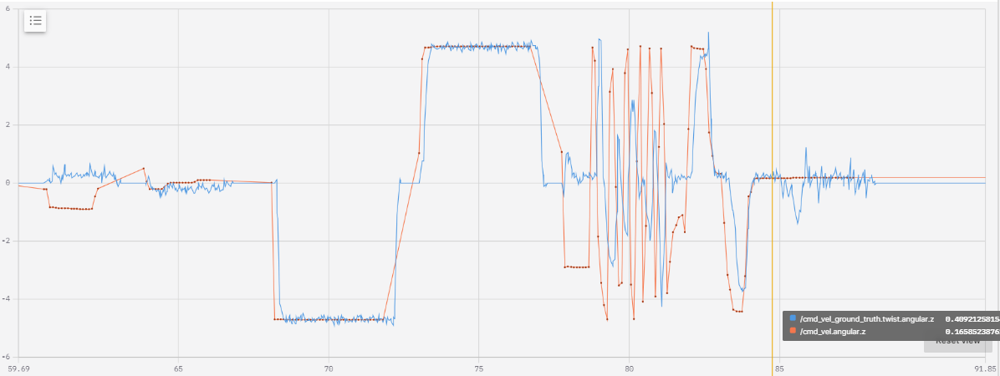

<!---
If you're new to markdown, check out this reference: https://www.markdownguide.org/basic-syntax/
-->

# Writeup

## Q0. Investigating Transforms in Foxglove (10 pts)

**Q0.1:** The rover moves forwards relative to the x-axis of `base_link` frame.
          To move forwards, `wheel_left` will rotate in the positive direction, while `wheel_left` will rotate in the negative direction.

## Q1. Identifying a Kinematic Model (20 pts)

**Q1.1:** 
$$
\begin{align*}
&\upsilon = \omega r = \frac{\upsilon_{L}+\upsilon_{R}}{2}\\
&\textnormal{if we're turning around a point at a distance r from the center of our wheels (the point is towards the right of the vehicle and omega is angular velocity where positive means turning to its right):} \\
&\upsilon_{L} = \omega (r+\frac{b}{2}) \qquad \upsilon_{R} = \omega (r-\frac{b}{2})\\
&r = \frac{\upsilon_{L}}{\omega} - \frac{b}{2} = \frac{\upsilon_{R}}{\omega} + \frac{b}{2}\\
&\upsilon_{L} = \upsilon_{R} + b \omega \\
&\upsilon = \frac{2 \upsilon_{R} + b\omega}{2} = \upsilon_{R} + \frac{b}{2}\omega\\
&\boxed{\upsilon_{R} = \upsilon - \frac{b}{2}\omega \qquad \upsilon_{L} = \upsilon + \frac{b}{2}\omega}
\end{align*}
$$

<!---
You can use latex syntax like so: $a_{example} = b_{example} + c_{example}$.
You can use $\upsilon$ for linear velocity and $\omega$ for angular velocity.

If you prefer to write out your work, you can include it in an image as follows:

-->

**Q1.2:** 

$$
\begin{align*}
&\boxed{\upsilon = \omega r = \frac{\upsilon_{L}+\upsilon_{R}}{2} }\qquad \textnormal{since the total velocity should be the average of the individual velocities (at the point in the middle of the wheels):} \\
&\upsilon_{R} = \upsilon - \frac{b}{2}\omega \qquad \upsilon_{L} = \upsilon + \frac{b}{2}\omega \qquad \textnormal{(from Q1.1):}\\
&\upsilon_{L} - \upsilon_{R} = \upsilon + \frac{b}{2}\omega - \upsilon + \frac{b}{2}\omega = b\omega\\
&\boxed{\omega = \frac{\upsilon_{L}-\upsilon_{R}}{b}}
&\end{align*}
$$

## Q2. Inverse Kinematics (20 pts)

**Q2.1:** Included in source code.

**Q2.2:** 

  

**Q2.3:** 

The graphs show the measured and predicted left (top graph) and right (bottom graph) wheel velocities as we drive around a bit. We do a series of simple motions: turn right, turn left, move forwards, move backwards, and run into a wall. As we turn we can see that both wheels have the same velocity which makes sense becuase we want to turn without moving and since each wheel turns the opposite way, this would make it rotate without going forwards or back. And when we move forwards/backwards we can see that the wheels move in opposite velocities which also makes sense since we'd want them to be spinning the same direction this time. I think it was interesting to see that the wheel velocities were still measured and the same magnitude as just going forwards when we drove into a wall since I thought the wheels would have a harder time turning when it was up against a wall. (also I lowk forgot that it was measuring wheel velocities and not the car velocity for a sec while driving it so I was surprised it wasn't reading 0 for a sec)

The motion that we predict will be different than the actual one since the motors may not be perfect so the real angular speed may be slightly different than the programmed one. Additionally, the wheel dimensions may not be perfectly measured and moving around on different grounds can affect the robot's speed. This is what we see when the robot moves forwards/backwards, the predicted velocity is overestimated which I believe is due to the ground being carpet, inhibiting how fast the motors can actually spin compared to what we program it to, however this logic may have some holes since when turning the predicted and measured velocities match up pretty well. This could be because when turning, the wheels don't move as fast though.

## Q3. Forward Kinematics (20 pts)

**Q3.1:** Included in source code.

**Q3.2:** 

 

**Q3.3:**

The graphs above show the linear x velocity (top graph) and the angular z velocity (bottom graph). Here we drive the robot in a series of motions: driving forwards, backwards, turning to right, left, going in quick random directions, and running into wall. Once again, when driving forwards/backwards, the commanded velocities overestimate the actual velocity. This is once again most likely due to the carpeted ground which could make the robot move slower. Additionally, there could be imperfections in the robot measurements of its velocity and measured physical characteristics. When turning the velocities match though. When the robot runs into the wall, the commanded velocity is very different from the actual one since it doesn't actually move.

## Q4. Calculating an Odometry Solution (30 pts)

**Q4.1:** Included in source code.

**Q4.2:** Included in source code.

**Q4.3:** 

When we hold the rover with its wheels in the air, the robot appears to moves forwards in foxglove even though its not actually moving.
When we stop one of the wheels with a hand, the robot appears to turn since only one wheel is moving.
When we run the rover into a wall, the robot moves forwards slowly since the wheel's motion are slightly inhibited. 

To make the robot's odemetry handle these cases, we could use cameras and the lidar to see if we're actually moving.
