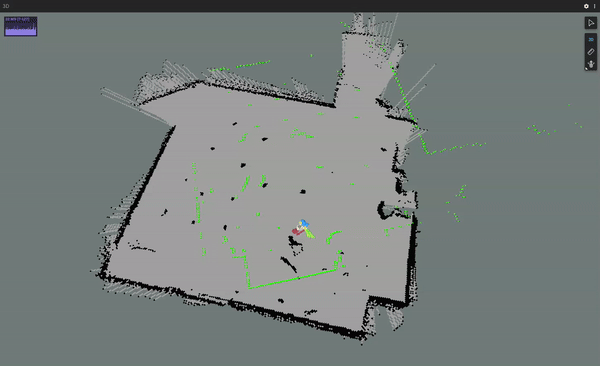
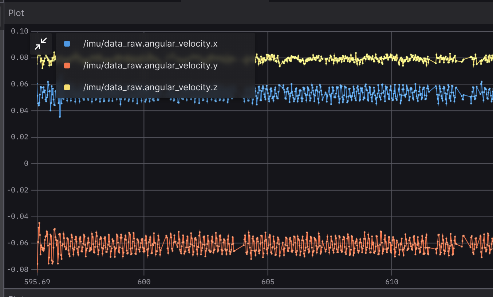
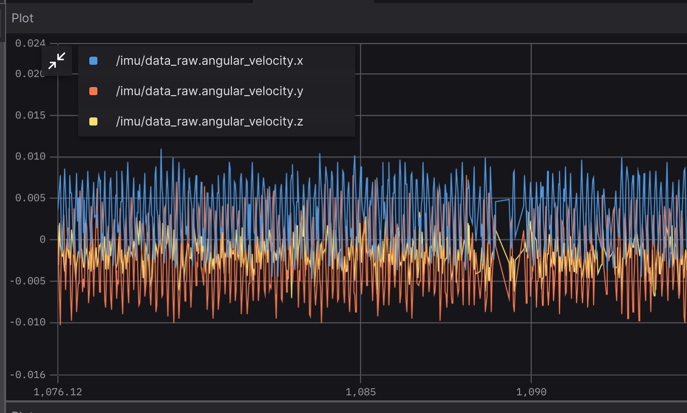
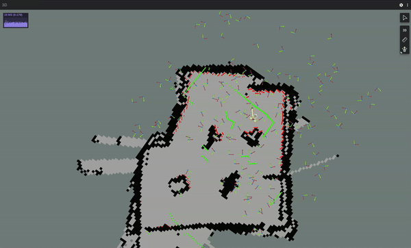
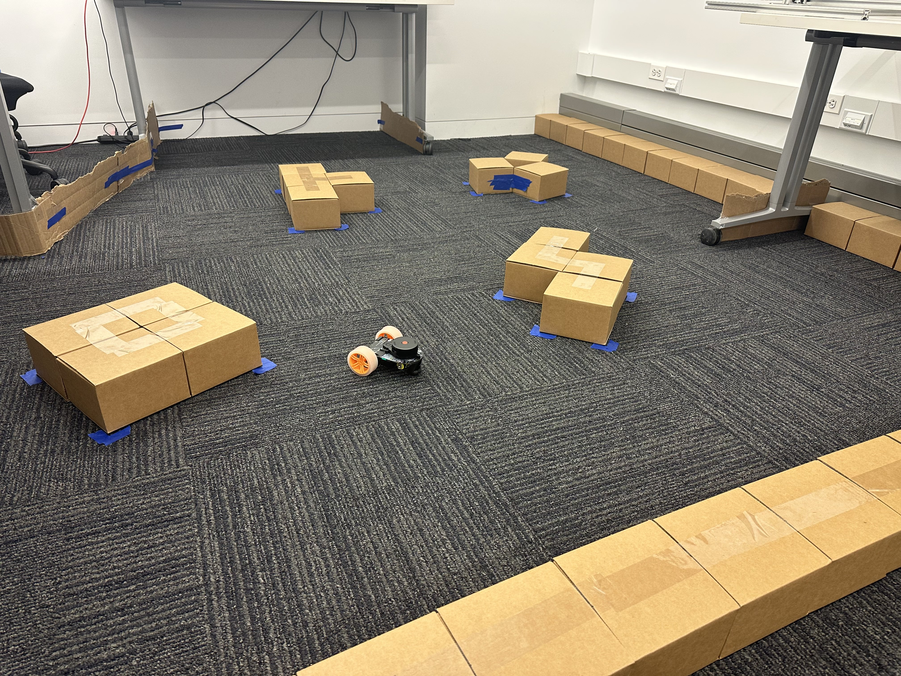
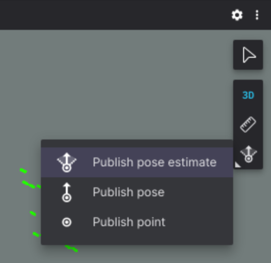
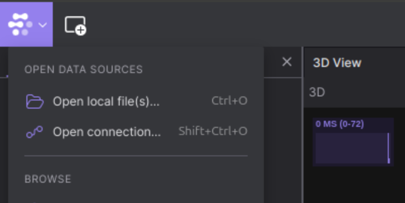
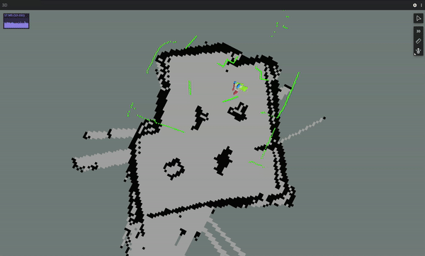

# HW 3: Localization

## Before you start

### Firmware update 
* Visit the [firmware tool](https://little-red-rover.com/#/firmware_tool).
* Follow the instructions on that page to connect your rover, then click "program".
* You should see progress output to the console (eg 10%, 20%, ect).
* When programming is complete, you'll see output from the MCU startup logs. At this point its safe to disconnect your robot.

### ROS driver update
* In a terminal outside of docker, open your lrr-fa24-beta folder. Run the following command:
  
 ```
 git pull && git submodule update
 ```

* If this doesn't work for you, just delete and reinstall the entire lrr-fa24-beta folder 😄 (see https://little-red-rover.com/#/software_installation?id=setting-up-your-development-environment)
* Rebuild the docker container
* Reconnect your robot to Wi-Fi. If you're on campus Wi-Fi, it's recommended to use Cornell-Visitor.

### Foxglove Layout
* Apply the layout `lrr_hw3_layout.json` in Foxglove in the same way you did in HW2.
   
### New Features!

Hot out the oven, here are some new features for your robot:

**Battery Level Monitoring**
* Your rover will now report its battery level on the `/battery` topic. The hw3 foxglove layout includes an indicator to track this information.

**Changes to Status LEDs**
* The robot now knows when ROS is up and running. The middle LED (labeled micro-ros on the PCB) now has two states:
  * Cyan: The robot is ready to connect to ROS, but no connection has been established.
  * Green: The robot is connected to ROS
 
### New Bugs :(

1. In an astounding turn of events, I've found a connection issue that only occurs in Gates G46 (or at least in that corner of the Gates basement). In G46 you'll be unable to connect to your rover before it gets logged onto Wi-Fi. This problem goes away if you go out to the Gates lobby, and once you're connected (with `lrr_connect`) you can return to G46 and keep using the rover like normal.

2. I found [an issue](https://github.com/little-red-rover/lrr-hardware/issues/2) with the rover's circuit that can kill the voltage regulator when the rover is operated for extended periods of time (> 2 hours) while charging.
For now, **please only charge the rover while it is powered off**. To be clear, this isn't a safety issue or anything, just a precaution to stop the rover from bricking itself.

 
## Overview

In this assignment we'll implement a particle filter to localize the rover within a known map. You'll implement a probabilistic sensor model, integrate it into the particle filter you wrote in FOR HW3, then test it in the real world. The real world environment is an arena I've setup in Gate G46 and mapped using SLAM.


> Localizing the rover in my apartment

## Code Review

You'll be writing code in the ROS package `hw3_pkg`. Specifically, you'll be implementing `particle_filter.py`. `particle_filter.py` is used by `pf_node.py` to produce a location estimate using your particle filter.

You'll be using the test files in `/test` to verify your implementation.

To run your completed algorithm, you'll use the launch file in `/launch/particle_filter.launch`. This launch file runs the following steps:

1. Includes `base.launch` from `lrr_base`. This brings up the drivers for communicating with the robot, and starts a node to produce odometry estimates ([see the source here](https://github.com/little-red-rover/lrr-ros/blob/noetic/lrr_base/launch/base.launch)).
2. Runs the node `map_server` from the package `map_server`. This provides the map file (found in `hw3_pkg/maps`) as a ros topic. [Read more if you're curious](http://wiki.ros.org/map_server).
3. Includes `viz.launch` from `lrr_viz`. This starts Foxglove bridge (how foxglove communicates with ROS. ([see the source here](https://github.com/little-red-rover/lrr-ros/blob/noetic/lrr_viz/launch/viz.launch)).
4. Runs your node, `particle_filter.py`. This starts your particle filter code.

You'll generate a recording of your ROS workspace using rosbag, ROS's tool for generating playback data.
You can read more about ROS bag files here: http://wiki.ros.org/Bags. They are an incredibly powerful tool for data collection and visibility.

Finally, you'll investigate how ROS allows you to use state of the part algorithms without having to implement them yourself.

## Q0. Gyroscope Tuning (20 pts)

The rover's Inertial Measurement Unit (IMU) contains an accelerometer (measuring linear acceleration) and a gyroscope (measuring angular velocity). All gyroscopes exhibit a small but constant bias in their velocity readings. When the velocity is integrated to compute an orientation, this bias leads to a constant rotation known as gyroscope drift. To see this in action, run:

```
lrr_run
```

and open Foxglove. Set the display frame to `/odom`. Unless you got lucky and got have an execeptionally accurate IMU, you should see the rover slowly rotating even while sitting still.

Although more advanced filtering techniques exist, we'll calibrate our gyroscope by simply subtracting out the bias term.

**Q0.1**

Within hw3_pkg, open `launch/particle_filter.launch`. You should see three parameters: `gyro_bias_{x, y, z}`.

Before running the next package, we need to install a couple Python packages. To do this, run

```
$(rospack find hw3_pkg)/scripts/setup_env.sh
```

Sit your rover on a flat surface and don't touch it. Run 

```
roslaunch hw3_pkg particle_filter.launch
```

Open Foxglove and navigate to the IMU plot tab. In the gyroscope panel, you'll see readings for the x, y, and z angular velocities.

> [!TIP]
> **Deliverable** - (10 pts): Take a screenshot of the IMU values at this point and include it in your report.


> Example biased gyro data, before tuning

Note that each reading has a DC bias (constant offset from zero) + gausian noise.
Eyeball the bias for each axis and update the `gyro_bias_` term in `particle_filter.launch`. This value will be subtracted from the respective axis.

Restart the `roslaunch` command from above. In the 3D view the rover should no longer be rotating. In the IMU panel the DC bias should have disappeared and all three readings should be centered on 0.
It's ok if the values are slightly off from zero, just try and get the center < +/-0.01 rad/s.

> [!TIP]
> **Deliverable** - (10 pts): Take a screenshot of the IMU values at this point and include it in your report.


> Example unbiased IMU data, after tuning

## Q1. Creating a Sensor Model (60 pts)


Before you write any code, run 

```
roslaunch hw3_pkg particle_filter.launch
```
 
 and open Foxglove. You'll see the map, the particles (each represented by a frame), and two LiDAR scans (one red, one green).

 The red scan is the data the particle filter expects would result from its estimate. The green scan is the data that is actually coming from the robot. When the particle filter correctly converges, the two scans will overlap.


> Localization using a particle filter. Notice how the ground truth (green) and predicted (red) scans line up once the preditiction converges.

Right now your filter will never converge. To get it to do so, you'll have to implement some missing functions.

Recall that a particle filter requires two components:

* A motion model, with which to update the particles between timesteps
* A sensor model, to report the likelihood that each particle is the correct pose

For simplicity we'll assume that the rover is stationary for this assignment. You'll implement the sensor model.

**Q1.1**

The LiDAR will be modeled as follows:

1. The LiDAR outputs 360 samples evenly spaced around the unit circle from ($-\pi$, $\pi$].
2. Each sample returns the distance from the center of the LiDAR to the nearest obstacle. If there is an error collecting a sample, it will return NaN.
3. Each measurement has additive gausian error.
4. All laser readings are independent and identically distributed (IID).

Point 4 allows us to compute the joint probability of each reading as the product of their individual probabilities.

In `hw3_pkg/particle_filter.py`, implement `sensor_model`. This will compute the probability of a reading `measurement` when the ground truth distances are `ground_truth`. 

Hint: Your solution should be very simple. Mine is two lines.

> [!TIP]
> **Deliverable** - (20 pts): Your implementation should pass the testcases `rostest hw3_pkg pf_tests.test` that start with test_sensor_model.

**Q1.2**

In `particle_filter.py`, implement `resample`. This will be identical to your FOR HW 3 question Q1.3 (the `LowVarianceSampler.resample` function).

> [!TIP]
 > **Delverable** - (40 pts): Your implementation should pass the testcases in `rostest hw3_pkg pf_tests.test`

## Q2. Particle Filter Localization in a Provided Map (20 pts)

From this point onward, you'll need to be in Gates G46 to test your algorithms.


> The arena setup in Gates G46

**Q2.1**

Time to test your implementation on the real robot. 

1. Place your robot in the arena

2. Run your node using the launch file

```
roslaunch hw3_pkg particle_filter.launch
```

3. Open Foxglove. You should see a map, the rover, and frames scattered around the map. Each frame corresponds to a particle in the particle filter.
The particles should start distributed over the map. They'll need some help to guess the robot's initial position. 

4. Find the "Publish pose estimate" button in the top right of the Foxglove 3D panel. If it says "Publish pose" or "Publish point", click and hold to open the options menu.



4. In the settigs for the 3D view, set the display frame to "map". Click once to set the pose position, then move the mouse and click again to set the orientation.

> [!WARNING]
> Make sure your display frame is set to map before you set your pose estimate. Otherwise, the pose will be published in the wrong coordinate frame.

6. Try localizing at different locations. Do some locations have better performance than others?

Now that you've confirmed your implementation works, let's record a bag file for submission.

rosbag is a tool that records all ROS messages and allows you to replay them later. If you're curious, you can read more here: https://wiki.ros.org/rosbag

Here's the command to record your bag:

```
rosbag record -O /lrr_ros_ws/src/lrr-fa24-beta-hw3/bags/pf_test.bag --duration=30 -a
```

* rosbag is the executable we call
* record tells rosbag to start a recording
* -O specifies the output filepath
* --duration=30 limits the recording to 30 seconds
* -a records all topics

After you execute this command, repeat steps 1-5 to localize your robot in the map. The bag will automatically finish recording after 30 seconds.

We can confirm that your recording worked correctly by opening it in Foxglove.
In the top left corner of Foxglove, click the Foxglove logo and then "Open local file(s)". Navigate to your bag file, which is in `lrr-fa24-beta-hw3/bags`. If everything went well, you can now playback your robot's localization!


> The Foxglove local file button

> [!TIP]
> **Deliverable** - (20 pts): Include the recorded rosbag in your submission. It should be in the folder `lrr-fa24-beta-hw3/bags`.

## Q3. Harnessing the Power of ROS: Using Cutting Edge Packages (20 pts)


> AMCL localization and driving around

Writing our own algorithms is all good and well, but it is HARD.
Why should we reinvent the wheel every time we add a new feature to our robot?
What if, instead, we let smarter people do the work for us?

ROS was built to abstract away the connection between hardware and high level algorithms.
This means that your little robot can run the exact same algorithms that power robots like [Boston Dynamic's SPOT](https://github.com/bdaiinstitute/spot_ros2) or run [self driving cars that are on the road today](https://autoware.org/).

This is why ROS is so powerful.

Let's look at how we can recreate everything you did in this assignment with just a few lines of code.

**Q.3.1**

Open `lrr-fa24-beta/src/lrr-ros/lrr-navigation/launch/amcl.launch`. Let's break down whats going on here.

1. `lrr-navigation` is a ROS package, a collection of related code and configuration files. This package contains launch files and configuration files for navigation related tasks for Little Red Rover.
2. The `launch` folder contains [ROS launch files](http://wiki.ros.org/roslaunch). These files list a collection of nodes and their parameters to run at the same time.
3. `amcl.launch` starts the `amcl` node from the `amcl` package. AMCL is an abreviation for Adaptive Monte Carlo Localization, a particle filter base approach for localization on a known map. The launch file also includes many parameters for tuning the localization. You can read more if you're curious: http://wiki.ros.org/amcl

Now open `lrr-fa24-beta/src/lrr_demos/launch/amcl_localization.launch`. Take a look at what this launch file executes. It combines `amcl.launch`, `base.launch`, and other nodes to setup the full localization pipeline. Notice that it also accepts arguments for the gyroscope bias we calculated in Q0.

Let's run the launch file and see what happens:

With all other nodes stopped, run

```
roslaunch mote_demos amcl_localization.launch map_file:=$(rospack find hw3_pkg)/maps/pleasepleasepleasepleaseplease.yaml
```

Return to Foxglove. Like with your particle filter, AMCL probably failed to localize without an initial prediction of the robot's location. Provided it using the "Publish pose estimate" button.

> [!WARNING]
> Again, make sure your display frame is set to map and fixed frame is set to Root Frame before you set your pose estimate. Otherwise, the pose will be published in the wrong coordinate frame, and AMCL will ignore it."

Once the localizatioroslaunch hw4_pkg pure_pursuit.launchn converges, drive your rover around the arena. Watch the robots position w.r.t the map.

How does the performance of AMCL compare with your particle filter?

Record a rosbag of AMCL localization tracking your rover around the map. **BE CAREFUL TO CHANGE THE NAME OF THE ROSBAG OUTPUT FILE**. Otherwise rosbag will overwrite your last rosbag. Use the command:

```
rosbag record -O /lrr_ros_ws/src/lrr-fa24-beta-hw3/bags/amcl_test.bag --duration=30 -a
```

> [!TIP]
> **Deliverable** - (20 pts): Include the recorded rosbag in your submission. It should be in the folder `lrr-fa24-beta-hw3/bags`.

## Deliverables

1. Zip and submit lrr-fa24-beta-hw3 on Gradescope.
2. Fill out the [hw3 feedback form](https://forms.gle/SvwNrA2Bsz9neSoJ7).

Good job! :)

