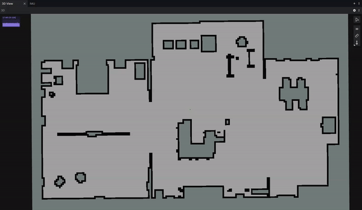

# HW 4: Path Planning and Control

## Before you start

### Firmware update 
* Visit the [firmware tool](https://little-red-rover.com/#/firmware_tool).
* Follow the instructions on that page to connect your rover, then click "program".
* You should see progress output to the console (eg 10%, 20%, ect).
* When programming is complete, you'll see output from the MCU startup logs. At this point its safe to disconnect your robot.

### ROS driver update
* In a terminal outside of docker, open your lrr-fa24-beta folder. Run the following command:
  
 ```
 git pull && git submodule update --remote --merge
 ```

* If this doesn't work for you, just delete and reinstall the entire lrr-fa24-beta folder 😄 (see https://little-red-rover.com/#/software_installation?id=setting-up-your-development-environment)
* Rebuild the docker container
* Reconnect your robot to Wi-Fi. If you're on campus Wi-Fi, it's recommended to use Cornell-Visitor.

### Foxglove Layout
* Apply the layout `lrr_hw4_layout.json` in Foxglove in the same way you did in HW3.
    
## Overview

In this assignment you'll implement path generation using a rapidly exploring random tree (RRT), then follow that path using pure pursuit.

> [!NOTE]
> You won't need the robot until question 3. For question 3, you will need the robot AND you'll need to be in Gates G46.

## Code Review

You'll be writing code in the ROS package `hw4_pkg`. 
Specifically, you'll be implementing the missing parts of an RRT implementation in `hw4_pkg/hw4_pkg/planning/search.py` and a Pure Pursuit implementation in `hw4_pkg/hw4_pkg/pure_pursuit.py`. 
To test your code, you'll use the test cases in `hw4_pkg/test` and the demo launch files in `hw4_pkg/launch`.

## Q1. Path generation using a Randomly exploring Random Tree (RRT) (30 pts)

The code in this section is directly pulled from your FOR HW 4, and should work out of the box. If not, let me know!

**Q1.1**

Implement the main RRT logic in `planning/search.py`.  First, implement the `extend` function in class `RRTPlanner`. Then, complete the `Plan` function. Specifically, you will need to sample a random point and add vertex/edge accordingly.  

Code not working how you hope it would? Try skipping to Q1.2 to visualize what's going on.

> [!TIP]
> **Deliverable** - (20 pts): Your implementation should pass the testcases in `rostest hw4_pkg rrt_tests.test`

**Q1.2**

I've provided a launch file `launch/rrt_test.launch` for running your RRT against a provided map. Let's take a look at whats it does:

1. Starts a map_server node, which maps the map file available over a ROS topic.

2. Starts `viz.launch` from package `lrr_viz`, which starts up the Foxglove connection.

3. Starts your node

Run it using

```
roslaunch hw4_pkg rrt_test.launch
```

You will first have to publish a starting pose using the "Publish pose estimate button". Next, publish a goal position using the "Publish pose" button. Note that these are two different options, as shown in the recording below.


> Running the RRT in Foxglove

> [!TIP]
> **Deliverable** - (10 pts): In your writeup, include a screenshot of the RRT finding a path as shown in Foxglove.

## Q2. Path following using Pure Pursuit (30 pts)

Now that we have a path, why not follow it. Maybe there will be something cool at the other end. Maybe not. One way to find out.

The algorithm we'll be using is geometric pure pursuit. If you're unfamiliar, please review the notes in Canvas under control/pure_pursuit.pdf.

**Q2.1**

In `pure_pursuit.py`, implement `compute_radius` to compute the (signed) radius of curvature using geometric pure pursuit.

> [!TIP]
> **Deliverable** - (20 pts): Your implementation should pass the testcases in `rostest hw4_pkg pure_pursuit_tests.test` that begin with `curve_radius`.

**Q2.2**

In `pure_pursuit.py`, implement `get_control` by calculating the required angular velocity to follow the curve..

> [!TIP]
> **Deliverable** - (10 pts): Your implementation should pass all testcases in `rostest hw4_pkg pure_pursuit_tests.test`.

## Q3. Real World Testing (40 pts)

Lets get this puppy on the road. Open up `launch/pure_pursuit.launch` and look at what it does:

1. Includes the LRR drivers.

2. Starts a map server to provide the map over a ROS topic

3. Starts foxglove

4. Includes `amcl.launch` from `lrr_navigation`. This runs AMCL, the particle filter localization node you used at the end of HW3.

5. Runs `costmap_node`. This node takes in our map and adds buffer room around obstacles. This helps keep the rover from running into walls.

6. Runs your pure pursuit node.

> [!WARNING]
> You'll probably need to update your gyro calibration, using the same technique as in HW3. Put the updated values in pure_pursuit.launch

Lets run it:

1. Place your robot within the map.

2. Start the launch file. 

```
roslaunch hw4_pkg pure_pursuit.launch
```

3. Open Foxglove and make sure your display frame is `map`

4. If AMCL incorrectly localized (you'll know if your robot in Foxglove and the real world don't line up), publish a pose estimate on the robots true location.

5. Publish the target pose in the same way you did in Q1.

7. The RRT should find a path, and the robot should start moving along it.

Once you've confirmed that your algorithm works, record a ROS bag showing it running. You can use the following command to record your bag:

```
rosbag record -O /lrr_ros_ws/src/lrr-fa24-beta-hw4/bags/pure_pursuit.bag --duration=30 -a
```


> A demo of pure pursuit control

> [!TIP]
> **Deliverable** - (40 pts): Include the recorded rosbag in your submission. It should be in the folder `lrr-fa24-beta-hw4/bags`.

## Deliverables

1. Zip and submit lrr-fa24-beta-hw4 Gradescope.
2. Fill out the [hw4 feedback form](https://forms.gle/phWtQz8qCF1ZTixw6).

You did it!
This is the last assignment of the beta.

Thank you so much for helping me test my robots :)

